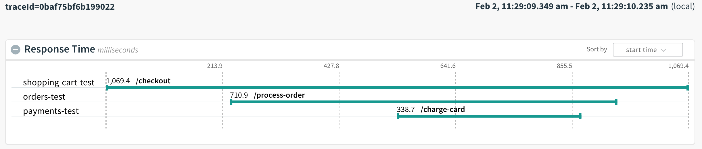

[](https://circleci.com/gh/pivotal-cf/pcf-metrics-trace-example-spring)

# PCF Metrics Spring Tracer Example

This is a Spring Boot repository with three apps: shopping-cart, orders, and payments.
These apps use [Spring Cloud Sleuth](https://cloud.spring.io/spring-cloud-sleuth/) to trace the calls between them. The traces can then be viewed in PCF-Metrics.

## Creating your own tracer apps

Most of the app code is standard Spring Boot application code independent of tracing.

To add tracing the following steps are neccesary:

- Each app should have the `compile('org.springframework.cloud:spring-cloud-starter-sleuth')` dependency in its build.gradle.

- Each SpringBootApplication should have the following snippet:

```
@Bean
public RestTemplate restTemplate() {
    return new RestTemplate();
}
```

This allows sleuth to determine which RestTemplate to insert itself into.

- Optionally, to see the parent span id in the app logs, the following line can be added to application.properties:

`logging.pattern.level: "%clr(%5p) %clr([${spring.application.name:-},%X{X-B3-TraceId:-},%X{X-B3-SpanId:-},%X{X-B3-ParentSpanId:-},%X{X-Span-Export:-}]){yellow}"`

Parent Span Id will show up in the router logs even without this property.

## Using the example apps

### DEPLOY
To use the script, you must login as a user that has the ability to assign space permissions and make spaces.
It will create a given shopping-cart, orders, and payments app that can be used to preview an example trace.

To deploy, use the script `./scripts/deploy.sh`.
Set the `SUFFIX` ENV var to a unique identifier for your tracer applications.

#### For example
```
cf login
SUFFIX=test ./scripts/deploy.sh
```

### CURL APPS
Curl the `/checkout` endpoint for the given shopping cart app.

#### For example
```
curl shopping-cart-test.cfapps.io/checkout
```

### CLEANUP

To cleanup, use the script `./scripts/cleanup.sh`.
Set the `SUFFIX` ENV var to the same identifier used for deployment.

#### For example
```
cf login
SUFFIX=test ./scripts/cleanup.sh
```

### Viewing in PCF-Metrics

To view the trace in PCF-Metrics, go to the shopping-cart app in PCF-Metrics.
Find the log corresponding to the /checkout endpoint and click the 'View in Trace Explorer' icon.

#### For example

